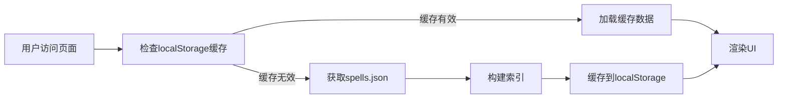
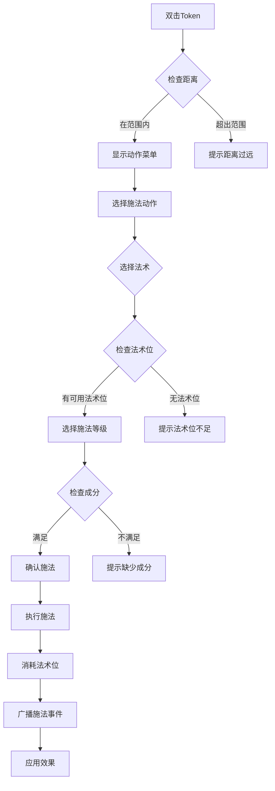

# D&D 5E 法术系统设计文档 - 前端架构版

## 🚀 实现状态

### ✅ 已完成功能（2024-11-13）

- [x] 法术数据加载和索引
- [x] 法术列表展示（网格/列表视图）
- [x] 法术搜索和筛选
- [x] 法术详情展示
- [x] 响应式设计
- [x] 暗色模式支持

### 🔧 待实现功能

- [ ] 角色法术管理
- [ ] 法术位追踪
- [ ] 施法记录
- [ ] 专注管理
- [ ] 与角色系统集成

## 架构概览

### 设计理念：重前端、轻后端

本方案采用**前端驱动**的架构设计，充分利用静态JSON数据和前端计算能力，最大程度减少服务器负载和网络请求。

### 核心优势

1. **性能优势**
   - 法术数据本地缓存，零延迟查询（<5ms响应）
   - 离线可用（PWA支持）
   - 减少服务器压力

2. **开发效率**
   - 前端可独立开发和测试
   - 减少后端API开发量（仅需3个API）
   - 规则修改不需要后端部署

3. **用户体验**
   - 即时响应，无需等待API
   - 流畅的交互体验
   - 支持复杂的前端筛选和搜索

## 系统架构

```
┌─────────────────────────────────────────────────┐
│                   前端 (React/Remix)             │
├─────────────────────────────────────────────────┤
│  静态资源层                                       │
│  ├── spells.json (411KB, 356个法术)              │
│  ├── class-spells.json (职业法术列表)            │
│  └── spell-slots.json (法术位表)                 │
├─────────────────────────────────────────────────┤
│  数据服务层                                       │
│  ├── SpellDataLoader (单例模式数据加载器)         │
│  ├── IndexBuilder (多维索引构建器)               │
│  ├── LocalStorage Cache (本地缓存)               │
│  └── Memory Cache (内存缓存)                     │
├─────────────────────────────────────────────────┤
│  业务逻辑层                                       │
│  ├── SpellCalculator (法术计算引擎)              │
│  ├── SpellManager (法术管理器)                   │
│  ├── ConcentrationTracker (专注追踪)             │
│  └── DeathSaveHandler (死亡豁免)                 │
├─────────────────────────────────────────────────┤
│  UI组件层                                         │
│  ├── SpellCard (法术卡片)                        │
│  ├── SpellList (法术列表)                        │
│  ├── SpellFilter (筛选器)                        │
│  └── SpellDetail (详情模态框)                    │
├─────────────────────────────────────────────────┤
│  状态管理 (Zustand)                              │
│  ├── spellStore (法术库存储)                     │
│  ├── characterSpellStore (角色法术状态)          │
│  └── combatStore (战斗状态)                      │
└─────────────────────────────────────────────────┘
                        ↓
                  最小化 API 调用
                        ↓
┌─────────────────────────────────────────────────┐
│                后端 (FastAPI)                    │
│  仅负责：                                        │
│  • 用户认证                                      │
│  • 角色数据持久化                                │
│  • 施法记录保存                                  │
│  • 实时同步（WebSocket）                         │
└─────────────────────────────────────────────────┘
```

## 已实现组件

### 1. 类型定义 (`~/types/spell.ts`)

```typescript
// 核心类型
export interface Spell {
  id: string
  name: string           // 中文名
  nameEn: string         // 英文名
  level: number          // 0-9，0为戏法
  school: SpellSchool    // 法术学派
  castingTime: string    // 施法时间
  range: string          // 施法距离
  components: SpellComponent[]  // 法术成分
  duration: string       // 持续时间
  ritual: boolean        // 是否可以仪式施法
  concentration: boolean // 是否需要专注
  description: string    // 详细描述
  classes: SpellClass[]  // 可学习的职业
  materials?: string     // 材料说明
  iconPath?: string      // 图标路径
}

// 其他类型定义...
```

### 2. 数据加载服务 (`~/services/spellDataLoader.ts`)

```typescript
class SpellDataLoader {
  // 单例模式
  private static instance: SpellDataLoader

  // 多维索引
  private spellMap: Map<string, Spell> = new Map()
  private spellsByLevel: Map<number, Spell[]> = new Map()
  private spellsByClass: Map<SpellClass, Spell[]> = new Map()
  private spellsBySchool: Map<SpellSchool, Spell[]> = new Map()

  // 核心方法
  async loadSpellData(): Promise<SpellData>
  searchSpells(query: string): Spell[]
  filterSpells(options: SpellFilterOptions): Spell[]
  sortSpells(spells: Spell[], sortBy: SpellSortOption): Spell[]
}
```

**特点：**

- 单例模式确保数据只加载一次
- 多维索引支持快速查询
- LocalStorage 缓存，24小时有效期
- 内存缓存优化重复查询

### 3. UI组件

#### SpellCard (`~/components/spell/SpellCard.tsx`)

- **紧凑模式**: 显示基本信息，点击展开
- **完整模式**: 显示所有法术详情
- **响应式设计**: 自适应不同屏幕尺寸

#### SpellList (`~/components/spell/SpellList.tsx`)

- **网格视图**: 多列卡片展示
- **列表视图**: 单列详细展示
- **性能优化**: 简化版，未来可加入虚拟滚动

#### SpellFilter (`~/components/spell/SpellFilter.tsx`)

- **搜索框**: 支持中英文搜索
- **多维筛选**: 等级、学派、职业、特殊属性
- **实时统计**: 显示筛选结果数量

### 4. 页面路由 (`~/routes/spells.tsx`)

```typescript
export default function SpellsPage() {
  // 状态管理
  const [spells, setSpells] = useState<Spell[]>([])
  const [filteredSpells, setFilteredSpells] = useState<Spell[]>([])
  const [viewMode, setViewMode] = useState<'grid' | 'list'>('grid')
  const [sortBy, setSortBy] = useState<SpellSortOption>('level')

  // 加载数据
  useEffect(() => {
    const loadData = async () => {
      const data = await spellDataLoader.loadSpellData()
      const allSpells = spellDataLoader.getAllSpells()
      setSpells(allSpells)
    }
    loadData()
  }, [])

  // 渲染UI...
}
```

## 数据流程

### 1. 初始加载流程



### 2. 搜索筛选流程


## 性能优化

### 已实现优化

1. **数据缓存**
   - localStorage 24小时缓存
   - 内存Map索引，O(1)查询
   - 避免重复网络请求

2. **索引优化**
   - 按ID、等级、学派、职业建立索引
   - 快速多维度筛选

3. **UI优化**
   - 条件渲染，减少DOM操作
   - 简化组件，未来可加虚拟滚动

### 待实现优化

1. **虚拟滚动**

   ```typescript
   // 使用 react-window
   <VariableSizeList
     height={600}
     itemCount={spells.length}
     itemSize={getItemSize}
   >
     {SpellCard}
   </VariableSizeList>
   ```

2. **Service Worker**

   ```javascript
   // 缓存静态资源
   self.addEventListener('fetch', (event) => {
     if (event.request.url.includes('spells.json')) {
       event.respondWith(/* 缓存策略 */)
     }
   })
   ```

3. **代码分割**

   ```typescript
   const SpellModule = lazy(() => import('./modules/SpellModule'))
   ```

## 后端API设计（最小化）

### 1. 同步角色法术状态

```python
@router.post("/api/characters/{character_id}/spells/sync")
async def sync_character_spells(
    character_id: str,
    spell_state: CharacterSpellState,
    db: AsyncSession = Depends(get_db)
):
    """同步角色法术状态（已知、已准备、法术位）"""
    await save_spell_state(db, character_id, spell_state)
    return {"status": "synced"}
```

### 2. 广播施法事件

```python
@router.post("/api/campaigns/{campaign_id}/spell-cast")
async def broadcast_spell_cast(
    campaign_id: str,
    cast_event: SpellCastEvent,
    ws_manager = Depends(get_ws_manager)
):
    """广播施法事件给其他玩家"""
    await ws_manager.broadcast(campaign_id, {
        "type": "spell_cast",
        "data": cast_event
    })
    return {"status": "broadcasted"}
```

### 3. 获取施法历史

```python
@router.get("/api/characters/{character_id}/spell-history")
async def get_spell_history(
    character_id: str,
    db: AsyncSession = Depends(get_db)
):
    """获取施法历史（用于统计）"""
    history = await fetch_spell_history(db, character_id)
    return history
```

## 使用指南

### 1. 访问法术系统

```bash
# 开发环境
http://localhost:5174/spells

# 或通过主页导航
主页 -> 法术大全
```

### 2. 功能使用

#### 搜索法术

- 在搜索框输入法术名称（中文或英文）
- 支持模糊搜索
- 实时显示结果

#### 筛选法术

1. 点击"筛选"按钮展开选项
2. 选择筛选条件：
   - 法术等级（戏法到9环）
   - 法术学派（8大学派）
   - 职业（8个施法职业）
   - 特殊属性（仪式/专注）
3. 支持多条件组合筛选

#### 查看详情

- **紧凑模式**：点击卡片展开/收起
- **模态框**：点击卡片弹出详情窗口

#### 切换视图

- **网格视图**：多列卡片展示，适合浏览
- **列表视图**：单列展示，信息更详细

## 文件结构

```
frontend/
├── app/
│   ├── types/
│   │   └── spell.ts              # 类型定义
│   ├── services/
│   │   └── spellDataLoader.ts    # 数据加载服务
│   ├── components/
│   │   └── spell/
│   │       ├── SpellCard.tsx     # 法术卡片
│   │       ├── SpellList.tsx     # 法术列表
│   │       └── SpellFilter.tsx   # 筛选器
│   ├── routes/
│   │   └── spells.tsx            # 法术页面
│   └── utils/
│       └── cn.ts                 # 样式工具
├── public/
│   └── dnd-platform/
│       └── configs/
│           └── rules/
│               └── spells.json   # 法术数据
```

## 开发计划

### Phase 1: 基础功能 ✅ (已完成)

- [x] 数据加载和展示
- [x] 搜索和筛选
- [x] 响应式设计

### Phase 2: 角色集成 (进行中)

- [ ] 角色法术书
- [ ] 已知法术管理
- [ ] 已准备法术
- [ ] 法术位追踪

#### 详细设计

##### 2.1 角色法术管理界面

**位置**: 玩家界面 -> 角色Tab -> 法术按钮

```typescript
interface CharacterSpellPanel {
  // 已准备法术区（需要准备的职业）
  preparedSpells: {
    title: "已准备法术",
    spells: Spell[],
    slots: SpellSlot[],
    canCast: boolean
  }

  // 已知法术区（可折叠）
  knownSpells: {
    title: "已知法术",
    spells: Spell[],
    collapsible: true,
    onPrepare?: (spell: Spell) => void
  }

  // 法术位显示
  spellSlots: {
    level: number,
    total: number,
    used: number
  }[]

  // 特殊资源（如邪术师契约位）
  specialResources?: {
    name: string,
    current: number,
    max: number
  }
}
```

##### 2.2 职业施法方式

```typescript
enum CastingType {
  PREPARED = "prepared",      // 需要准备（牧师、德鲁伊、圣骑士、法师）
  SPONTANEOUS = "spontaneous", // 自发施法（吟游诗人、游侠、术士）
  PACT = "pact"               // 契约施法（邪术师）
}

interface ClassSpellcasting {
  className: string
  castingType: CastingType
  spellsKnown?: number        // 已知法术数量
  preparedFormula?: string    // 准备法术公式
  spellSlots: SpellSlotTable
  features: string[]          // 特殊能力
}

// 职业施法配置
const SPELLCASTING_CLASSES = {
  // 全施法者 (Full Casters) - 获得9环法术
  wizard: {
    castingType: CastingType.PREPARED,
    castingAbility: 'intelligence',
    preparedFormula: "智力调整值 + 法师等级",
    needsPrepare: true,
    ritual: true,
    spellbook: true,
    maxSpellLevel: 9,
    features: {
      arcaneRecovery: true,  // 奥术恢复：短休回复法术位
      spellMastery: 18,       // 18级：精通1、2环法术
      signatureSpells: 20     // 20级：标志法术
    }
  },

  cleric: {
    castingType: CastingType.PREPARED,
    castingAbility: 'wisdom',
    preparedFormula: "感知调整值 + 牧师等级",
    needsPrepare: true,
    ritual: true,
    maxSpellLevel: 9,
    features: {
      domainSpells: true,     // 领域法术总是准备
      channelDivinity: true,  // 引导神力
      divineIntervention: 10  // 10级获得神圣干预
    }
  },

  sorcerer: {
    castingType: CastingType.SPONTANEOUS,
    castingAbility: 'charisma',
    spellsKnownTable: true,    // 使用已知法术表
    maxSpellLevel: 9,
    features: {
      sorceryPoints: true,     // 术法点
      metamagic: true,         // 超魔能力
      flexibleCasting: true    // 灵活施法：法术位与术法点转换
    }
  },

  warlock: {
    castingType: CastingType.PACT,
    castingAbility: 'charisma',
    pactSlotLevel: "所有契约法术位为最高等级",
    pactSlotProgression: {
      1: { slots: 1, level: 1 },
      2: { slots: 2, level: 1 },
      3: { slots: 2, level: 2 },
      5: { slots: 2, level: 3 },
      7: { slots: 2, level: 4 },
      9: { slots: 2, level: 5 },
      11: { slots: 3, level: 5 },
      17: { slots: 4, level: 5 }
    },
    maxPactLevel: 5,
    features: {
      invocations: true,       // 魔能祈唤
      mysticArcanum: true,     // 神秘奥法：6-9环法术
      eldritchMaster: 20       // 20级：恳求宗主恢复法术位
    }
  },

  bard: {
    castingType: CastingType.SPONTANEOUS,
    castingAbility: 'charisma',
    spellsKnownTable: true,
    ritual: true,
    maxSpellLevel: 9,
    features: {
      bardicInspiration: true, // 吟游诗人激励
      magicalSecrets: [10, 14, 18], // 10、14、18级获得魔法奥秘
      songOfRest: true,        // 休憩之歌
      countercharm: 6,         // 6级：反魅惑
      jackOfAllTrades: true    // 博学：法术攻击检定也加半个熟练
    }
  },

  druid: {
    castingType: CastingType.PREPARED,
    castingAbility: 'wisdom',
    preparedFormula: "感知调整值 + 德鲁伊等级",
    needsPrepare: true,
    ritual: true,
    maxSpellLevel: 9,
    features: {
      wildShape: true,         // 野性变形
      circleSpells: true,      // 结社法术（某些子职）
      landStride: 6,           // 6级：穿林
      beastSpells: 18          // 18级：野兽施法
    }
  },

  // 半施法者 (Half Casters) - 获得5环法术
  paladin: {
    castingType: CastingType.PREPARED,
    castingAbility: 'charisma',
    preparedFormula: "魅力调整值 + 圣骑士等级的一半（至少为1）",
    needsPrepare: true,
    startLevel: 2,             // 2级获得施法能力
    maxSpellLevel: 5,
    features: {
      oathSpells: true,        // 誓言法术总是准备
      divineSmite: true,       // 神圣打击
      layOnHands: true,        // 圣疗术
      channelDivinity: 3,      // 3级：引导神力
      improvedDivineSmite: 11  // 11级：精通神圣打击
    }
  },

  ranger: {
    castingType: CastingType.SPONTANEOUS,
    castingAbility: 'wisdom',
    spellsKnownTable: true,
    startLevel: 2,             // 2级获得施法能力
    maxSpellLevel: 5,
    features: {
      primevalAwareness: true, // 原始感知（使用法术位）
      huntersMark: true,       // 标志性法术：猎人印记
      favoriteTerrain: true,   // 偏好地形
      naturalExplorer: true    // 自然探索者
    }
  },

  // 三分之一施法者 (Third Casters) - 获得4环法术
  eldritchKnight: {
    parentClass: 'fighter',
    subclass: true,
    castingType: CastingType.SPONTANEOUS,
    castingAbility: 'intelligence',
    spellsKnownTable: true,
    startLevel: 3,             // 3级获得施法能力
    maxSpellLevel: 4,
    spellSchoolRestriction: ['abjuration', 'evocation'], // 限制学派
    features: {
      weaponBond: true,        // 武器联结
      warMagic: 7,            // 7级：战争魔法
      eldritchStrike: 10,     // 10级：魔能打击
      arcaneCharge: 15,       // 15级：奥术冲锋
      improvedWarMagic: 18    // 18级：精通战争魔法
    }
  },

  arcaneTrickster: {
    parentClass: 'rogue',
    subclass: true,
    castingType: CastingType.SPONTANEOUS,
    castingAbility: 'intelligence',
    spellsKnownTable: true,
    startLevel: 3,             // 3级获得施法能力
    maxSpellLevel: 4,
    spellSchoolRestriction: ['enchantment', 'illusion'], // 限制学派
    features: {
      mageHandLegerdemain: true, // 法师之手戏法
      magicalAmbush: 9,          // 9级：魔法伏击
      versatileTrickster: 13,    // 13级：多才妙手
      spellThief: 17             // 17级：盗法者
    }
  }
}

### 4.x 施法规则配置 JSON（前端主数据源）

为符合“重前端轻后端 + 规则全部走静态配置”的理念，法术位进度表、已知法术数量表等已经抽到统一的 JSON 文件中：

- `dnd-platform/configs/rules/spellcasting.json`
  - `slotTables.fullCaster / halfCaster / thirdCaster`
  - `spellsKnownTables`
  - `pactMagic`（术士契约位）
  - `multiclass`（兼职施法权重与职业类别）
- `dnd-platform/configs/rules/subclass-spells.json`
  - 各职业子职业（领域/誓言/宗主等）的“额外领域法术”列表

在代码层面，我们不再手写这些表，而是从 JSON 读取：

```ts
import spellcastingConfig from 'dnd-platform/configs/rules/spellcasting.json'

const FULL_CASTER_SPELL_SLOTS  = spellcastingConfig.slotTables.fullCaster
const HALF_CASTER_SPELL_SLOTS  = spellcastingConfig.slotTables.halfCaster
const THIRD_CASTER_SPELL_SLOTS = spellcastingConfig.slotTables.thirdCaster
const SPELLS_KNOWN_TABLE       = spellcastingConfig.spellsKnownTables
```

> 为避免重复，本设计文档不再展开整张进度表/已知法术数量表，真实数据以上述 JSON 为准；
> 下文出现的 `SpellcastingUtils` 等 TypeScript 片段，属于**设计蓝图/示意代码**，用于说明如何在前端从 JSON 读取并计算相关数值；
> 实际项目中，具体实现以前端代码和 JSON 配置为准（见下）。

#### 当前实现 vs 设计蓝图

- **已落地实现：**
  - 施法规则 JSON：
    - 后端：`dnd-platform/configs/rules/spellcasting.json`
    - 前端：`frontend/app/data/rules/spellcasting.json`
  - 子职业法术 JSON：
    - 后端：`dnd-platform/configs/rules/subclass-spells.json`
    - 前端：`frontend/app/data/rules/subclass-spells.json`
  - 领域/誓约“总是准备，不占准备上限”的逻辑：
    - 自动计算：`frontend/app/components/character/CharacterDisplay/utils/spellcasting.ts`（`getAlwaysPreparedSubclassSpells`）
    - 角色状态与计数：`frontend/app/components/character/CharacterDisplay/hooks/useSpells.ts`（`autoPrepared` + `preparedCount` 排除）
    - UI 展示：`frontend/app/components/character/CharacterDisplay/sections/Spells/SpellsDialog.tsx`（自动准备法术复选框禁用）

- **仍处于设计蓝图阶段（尚未完全按此结构实现）：**
  - 文档中出现的 `SPELLCASTING_CLASSES`、`SpellcastingUtils`、`MulticlassSpellcasting`、`ClassSpecialFeatures`
  - `useCharacterSpellcasting`、`CharacterSpellPanel`、`TokenActionMenu`、`useCharacterSpellStore` 等 hooks/组件示例
  - 完整的法术位追踪/施法记录/Token 施法菜单等交互流程

> 后续如果继续实现“推荐法术池”、专注管理、完整施法位追踪等增强特性，也可以在此小节追加对应文件路径。

// 法术位进度表 (Full Caster)
// 👉 实际数据见：dnd-platform/configs/rules/spellcasting.json 的 slotTables.fullCaster

// 法术位进度表 (Half Caster) - 圣骑士、游侠
// 👉 实际数据见：dnd-platform/configs/rules/spellcasting.json 的 slotTables.halfCaster

// 法术位进度表 (Third Caster) - 奥法骑士、奥术骗徒
// 👉 实际数据见：dnd-platform/configs/rules/spellcasting.json 的 slotTables.thirdCaster

// 已知法术数量表 (术士/吟游诗人/游侠/奥法骑士/奥术骗徒)
// 👉 实际数据见：dnd-platform/configs/rules/spellcasting.json 的 spellsKnownTables

// 施法能力计算辅助函数
const SpellcastingUtils = {
  // 获取法术位
  getSpellSlots(className: string, level: number): number[] {
    const config = SPELLCASTING_CLASSES[className]
    if (!config) return []

    if (config.castingType === CastingType.PACT) {
      // 契约施法者特殊处理
      const pactData = config.pactSlotProgression[level] || { slots: 0, level: 0 }
      const slots = new Array(9).fill(0)
      if (pactData.level > 0) {
        slots[pactData.level - 1] = pactData.slots
      }
      return slots
    }

    // 根据施法者类型返回对应表
    if (config.maxSpellLevel === 9) {
      return FULL_CASTER_SPELL_SLOTS[level] || []
    } else if (config.maxSpellLevel === 5) {
      return HALF_CASTER_SPELL_SLOTS[level] || []
    } else if (config.maxSpellLevel === 4) {
      return THIRD_CASTER_SPELL_SLOTS[level] || []
    }
    return []
  },

  // 获取已知法术数量
  getSpellsKnown(className: string, level: number): number {
    return SPELLS_KNOWN_TABLE[className]?.[level] || 0
  },

  // 计算准备法术数量
  getPreparedSpells(className: string, level: number, abilityMod: number): number {
    const config = SPELLCASTING_CLASSES[className]
    if (!config || config.castingType !== CastingType.PREPARED) return 0

    // 基础公式：能力调整值 + 职业等级（或半等级）
    let prepared = abilityMod + level

    // 圣骑士和游侠使用半等级
    if (className === 'paladin') {
      prepared = abilityMod + Math.floor(level / 2)
    }

    return Math.max(1, prepared) // 至少准备1个法术
  },

  // 获取法术攻击加值
  getSpellAttackBonus(proficiency: number, abilityMod: number): number {
    return proficiency + abilityMod
  },

  // 获取法术豁免DC
  getSpellSaveDC(proficiency: number, abilityMod: number): number {
    return 8 + proficiency + abilityMod
  },

  // 检查是否可以施放某环级法术
  canCastSpellLevel(className: string, characterLevel: number, spellLevel: number): boolean {
    const slots = this.getSpellSlots(className, characterLevel)
    return spellLevel === 0 || (slots[spellLevel - 1] > 0) // 戏法或有对应法术位
  },

  // 获取最高可施法环级
  getMaxSpellLevel(className: string, characterLevel: number): number {
    const slots = this.getSpellSlots(className, characterLevel)
    for (let i = slots.length - 1; i >= 0; i--) {
      if (slots[i] > 0) return i + 1
    }
    return 0 // 只能施放戏法
  }
}

// 兼职施法者等级计算
const MulticlassSpellcasting = {
  // 计算兼职施法者等级
  calculateMulticlassLevel(classes: { className: string, level: number }[]): number {
    let totalLevel = 0

    for (const cls of classes) {
      const config = SPELLCASTING_CLASSES[cls.className]
      if (!config) continue

      // 全施法者：等级 x 1
      if (config.maxSpellLevel === 9) {
        totalLevel += cls.level
      }
      // 半施法者：等级 x 0.5（向下取整）
      else if (config.maxSpellLevel === 5) {
        totalLevel += Math.floor(cls.level / 2)
      }
      // 三分之一施法者：等级 x 0.33（向下取整）
      else if (config.maxSpellLevel === 4) {
        totalLevel += Math.floor(cls.level / 3)
      }
      // 契约施法者不计入兼职计算
    }

    return totalLevel
  },

  // 获取兼职法术位
  getMulticlassSpellSlots(classes: { className: string, level: number }[]): number[] {
    const multiclassLevel = this.calculateMulticlassLevel(classes)

    // 检查是否有契约施法者
    const warlockClass = classes.find(c => c.className === 'warlock')
    const baseSlots = FULL_CASTER_SPELL_SLOTS[multiclassLevel] || new Array(9).fill(0)

    // 契约法术位独立计算
    if (warlockClass) {
      const warlockConfig = SPELLCASTING_CLASSES.warlock
      const pactData = warlockConfig.pactSlotProgression[warlockClass.level]
      // 契约法术位单独追踪，不与常规法术位混合
      return {
        regular: baseSlots,
        pact: pactData || { slots: 0, level: 0 }
      }
    }

    return baseSlots
  }
}

// 特殊职业能力实现示例
const ClassSpecialFeatures = {
  // 术士：术法点系统
  sorceryPoints: {
    getMaxPoints(level: number): number {
      return level // 术法点 = 术士等级
    },

    // 灵活施法：法术位转术法点
    slotToPoints(slotLevel: number): number {
      return slotLevel // 法术位等级 = 术法点
    },

    // 灵活施法：术法点转法术位
    pointsToSlot(slotLevel: number): number {
      const costs = { 1: 2, 2: 3, 3: 5, 4: 6, 5: 7 }
      return costs[slotLevel] || 0
    }
  },

  // 法师：奥术恢复
  arcaneRecovery: {
    getRecoverableSlotLevels(wizardLevel: number): number {
      return Math.ceil(wizardLevel / 2) // 可恢复的法术位等级总和
    },

    canRecover(slotLevel: number): boolean {
      return slotLevel >= 1 && slotLevel <= 5 // 只能恢复1-5环
    }
  },

  // 圣骑士：神圣打击
  divineSmite: {
    getDamageBonus(slotLevel: number, isUndead: boolean = false): string {
      const baseDice = slotLevel + 1 // (法术位等级+1)d8
      const bonusDice = isUndead ? 1 : 0 // 对不死生物额外1d8
      const maxDice = Math.min(baseDice + bonusDice, 5) // 最多5d8(6d8对不死生物)
      return `${maxDice}d8`
    }
  },

  // 吟游诗人：魔法奥秘
  magicalSecrets: {
    getExtraSpells(bardLevel: number): number {
      if (bardLevel >= 18) return 6
      if (bardLevel >= 14) return 4
      if (bardLevel >= 10) return 2
      return 0
    }
  }
}

```

##### 2.4 完整使用示例

```typescript
// frontend/app/hooks/useCharacterSpellcasting.ts

import { useState, useEffect, useMemo } from 'react'
import { spellDataLoader } from '~/services/spellDataLoader'

export function useCharacterSpellcasting(character: Character) {
  const [knownSpells, setKnownSpells] = useState<Spell[]>([])
  const [preparedSpells, setPreparedSpells] = useState<Spell[]>([])
  const [spellSlots, setSpellSlots] = useState<SpellSlots>({})

  // 获取职业配置
  const classConfig = useMemo(() => {
    // 处理兼职
    if (character.multiclass) {
      return MulticlassSpellcasting.getMulticlassSpellSlots(character.classes)
    }
    return SPELLCASTING_CLASSES[character.class]
  }, [character])

  // 计算能力值修正
  const abilityMod = useMemo(() => {
    const ability = classConfig?.castingAbility
    if (!ability) return 0
    return Math.floor((character.abilities[ability] - 10) / 2)
  }, [character, classConfig])

  // 计算法术位
  useEffect(() => {
    const slots = SpellcastingUtils.getSpellSlots(
      character.class,
      character.level
    )
    setSpellSlots(slots)
  }, [character.class, character.level])

  // 计算可准备法术数量
  const maxPrepared = useMemo(() => {
    if (classConfig?.needsPrepare) {
      return SpellcastingUtils.getPreparedSpells(
        character.class,
        character.level,
        abilityMod
      )
    }
    return 0
  }, [character, abilityMod, classConfig])

  // 计算已知法术数量
  const maxKnown = useMemo(() => {
    if (classConfig?.spellsKnownTable) {
      return SpellcastingUtils.getSpellsKnown(character.class, character.level)
    }
    return 0
  }, [character, classConfig])

  // 计算法术攻击和DC
  const spellStats = useMemo(() => {
    const proficiency = Math.ceil(1 + character.level / 4) // 简化的熟练加值计算
    return {
      attackBonus: SpellcastingUtils.getSpellAttackBonus(proficiency, abilityMod),
      saveDC: SpellcastingUtils.getSpellSaveDC(proficiency, abilityMod)
    }
  }, [character.level, abilityMod])

  // 准备法术
  const prepareSpell = (spell: Spell) => {
    if (preparedSpells.length >= maxPrepared) {
      alert(`最多只能准备 ${maxPrepared} 个法术`)
      return
    }
    setPreparedSpells([...preparedSpells, spell])
  }

  // 取消准备
  const unprepareSpell = (spellId: string) => {
    setPreparedSpells(preparedSpells.filter(s => s.id !== spellId))
  }

  // 施放法术
  const castSpell = (spell: Spell, slotLevel?: number) => {
    const actualSlot = slotLevel || spell.level
    if (actualSlot > 0 && spellSlots[actualSlot - 1] <= 0) {
      alert('没有可用的法术位')
      return false
    }

    // 扣除法术位
    if (actualSlot > 0) {
      const newSlots = [...spellSlots]
      newSlots[actualSlot - 1]--
      setSpellSlots(newSlots)
    }

    // 记录施法（可以发送到后端）
    console.log(`施放法术: ${spell.name} (${actualSlot}环)`)
    return true
  }

  // 获取可用法术（基于距离）
  const getAvailableSpells = (targetDistance: number) => {
    return preparedSpells.filter(spell => {
      // 解析距离（简化版）
      const range = spell.range.toLowerCase()
      if (range.includes('自身')) return true
      if (range.includes('接触')) return targetDistance <= 5
      if (range.includes('英尺')) {
        const feet = parseInt(range.match(/(\d+)/)?.[0] || '0')
        return targetDistance <= feet
      }
      return true
    })
  }

  // 长休恢复
  const longRest = () => {
    // 恢复所有法术位
    const maxSlots = SpellcastingUtils.getSpellSlots(
      character.class,
      character.level
    )
    setSpellSlots(maxSlots)

    // 契约施法者短休也恢复
    if (character.class === 'warlock') {
      console.log('契约法术位已恢复')
    }
  }

  // 短休恢复（特殊能力）
  const shortRest = () => {
    // 契约施法者恢复
    if (character.class === 'warlock') {
      longRest() // 契约施法者短休恢复所有法术位
    }

    // 法师奥术恢复
    if (character.class === 'wizard' && character.features?.arcaneRecoveryUsed === false) {
      const recoverable = ClassSpecialFeatures.arcaneRecovery.getRecoverableSlotLevels(
        character.level
      )
      console.log(`可以恢复总计 ${recoverable} 环级的法术位`)
      // 实现恢复逻辑...
    }
  }

  return {
    knownSpells,
    preparedSpells,
    spellSlots,
    maxPrepared,
    maxKnown,
    spellStats,
    classConfig,
    prepareSpell,
    unprepareSpell,
    castSpell,
    getAvailableSpells,
    longRest,
    shortRest
  }
}

// 使用示例
export function CharacterSpellPanel({ character }) {
  const {
    knownSpells,
    preparedSpells,
    spellSlots,
    spellStats,
    castSpell,
    prepareSpell
  } = useCharacterSpellcasting(character)

  return (
    <div className="spell-panel">
      {/* 法术统计 */}
      <div className="spell-stats">
        <span>法术攻击加值: +{spellStats.attackBonus}</span>
        <span>法术豁免DC: {spellStats.saveDC}</span>
      </div>

      {/* 法术位显示 */}
      <div className="spell-slots">
        {spellSlots.map((count, index) => (
          <div key={index}>
            {index + 1}环: {count} 个
          </div>
        ))}
      </div>

      {/* 已准备法术列表 */}
      <div className="prepared-spells">
        {preparedSpells.map(spell => (
          <SpellCard
            key={spell.id}
            spell={spell}
            onCast={() => castSpell(spell)}
          />
        ))}
      </div>
    </div>
  )
}
```

##### 2.5 Token施法交互

**触发**: 双击其他角色Token

```typescript
interface TokenActionMenu {
  // 基础动作
  normalActions: Action[]     // 普通动作
  combatActions: Action[]      // 战斗动作

  // 新增：施法动作
  spellActions: {
    title: "施法",
    icon: "✨",
    spells: AvailableSpell[],  // 可用法术
    onCast: (spell: Spell, target: Token) => void
  }
}

interface AvailableSpell {
  spell: Spell
  canCast: boolean            // 是否可施放
  reason?: string             // 不能施放的原因
  slotLevel?: number[]        // 可用的法术位等级
  components: {
    V: boolean,
    S: boolean,
    M: { has: boolean, material?: string }
  }
  range: {
    value: number,
    unit: string,
    inRange: boolean
  }
}
```

##### 2.4 法术位追踪系统

```typescript
interface SpellSlotTracker {
  // 标准法术位
  standardSlots: {
    [level: number]: {
      total: number,
      used: number,
      temp: number      // 临时法术位
    }
  }

  // 契约法术位（邪术师）
  pactSlots?: {
    level: number,      // 契约位等级
    total: number,
    used: number
  }

  // 特殊资源
  specialResources: {
    sorceryPoints?: number,     // 术士点
    channelDivinity?: number,   // 牧师引导神力
    wildShape?: number,         // 德鲁伊野性变形
    layOnHands?: number         // 圣骑士圣疗
  }

  // 恢复规则
  recovery: {
    shortRest: () => void,      // 短休恢复
    longRest: () => void,       // 长休恢复
    arcaneRecovery?: () => void // 法师奥术恢复
  }
}
```

##### 2.5 UI组件设计

```typescript
// 1. 角色法术面板
<CharacterSpellPanel>
  <PreparedSpellsSection />     // 已准备法术
  <SpellSlotsDisplay />         // 法术位显示
  <KnownSpellsSection />        // 已知法术（可折叠）
  <SpecialResourcesBar />       // 特殊资源
</CharacterSpellPanel>

// 2. Token施法菜单
<TokenSpellMenu>
  <SpellCategories />           // 法术分类（戏法/1-9环）
  <SpellQuickList />           // 快速法术列表
  <SpellDetails />             // 法术详情
  <TargetingHelper />          // 目标辅助
  <CastButton />               // 施法按钮
</TokenSpellMenu>

// 3. 法术位指示器
<SpellSlotIndicator>
  <SlotLevel />                // 环级
  <SlotPips />                 // 圆点显示
  <SlotNumbers />              // 数字显示
  <RecoveryTimer />            // 恢复计时
</SpellSlotIndicator>
```

##### 2.6 施法流程



##### 2.7 数据结构

```typescript
// 角色法术数据
interface CharacterSpellData {
  characterId: string
  class: string
  level: number

  // 施法能力
  spellcastingAbility: 'INT' | 'WIS' | 'CHA'
  spellSaveDC: number
  spellAttackBonus: number

  // 法术列表
  knownSpells: string[]        // 已知法术ID
  preparedSpells: string[]     // 已准备法术ID

  // 法术位状态
  spellSlots: {
    [level: number]: {
      max: number,
      current: number
    }
  }

  // 特殊能力
  features: {
    ritualCasting?: boolean
    spellbook?: SpellbookData
    metamagic?: MetamagicOption[]
    invocations?: Invocation[]
  }

  // 施法记录
  castHistory: CastRecord[]
}
```

##### 2.8 实现示例

###### 角色Tab法术按钮

```tsx
// frontend/app/components/character/SpellButton.tsx
export function CharacterSpellButton({ character }: { character: Character }) {
  const [showSpellPanel, setShowSpellPanel] = useState(false)
  const { knownSpells, preparedSpells, spellSlots } = useCharacterSpells(character.id)

  return (
    <>
      <button
        onClick={() => setShowSpellPanel(true)}
        className="spell-button"
      >
        <span>🔮</span>
        <span>法术</span>
        {/* 显示可用法术位 */}
        <SpellSlotBadge slots={spellSlots} />
      </button>

      {showSpellPanel && (
        <SpellPanel
          character={character}
          onClose={() => setShowSpellPanel(false)}
        />
      )}
    </>
  )
}
```

###### 法术面板组件

```tsx
// frontend/app/components/character/SpellPanel.tsx
export function SpellPanel({ character, onClose }) {
  const needsPrepare = SPELLCASTING_CLASSES[character.class]?.needsPrepare

  return (
    <div className="spell-panel">
      {/* 标题栏 */}
      <header>
        <h3>{character.name}的法术</h3>
        <button onClick={onClose}>×</button>
      </header>

      {/* 法术位显示 */}
      <SpellSlotsDisplay slots={character.spellSlots} />

      {/* 已准备法术（需要准备的职业） */}
      {needsPrepare && (
        <section className="prepared-spells">
          <h4>已准备法术</h4>
          <SpellList
            spells={character.preparedSpells}
            showSlotLevel
            onCast={handleCast}
          />
        </section>
      )}

      {/* 已知法术（可折叠） */}
      <Collapsible title="已知法术">
        <SpellList
          spells={character.knownSpells}
          onPrepare={needsPrepare ? handlePrepare : undefined}
          disabled={character.preparedSpells}
        />
      </Collapsible>

      {/* 特殊资源 */}
      {character.specialResources && (
        <SpecialResourceBar resources={character.specialResources} />
      )}
    </div>
  )
}
```

###### Token施法动作

```tsx
// frontend/app/components/map/TokenActionMenu.tsx
export function TokenActionMenu({ sourceToken, targetToken }) {
  const distance = calculateDistance(sourceToken, targetToken)
  const availableSpells = getAvailableSpells(sourceToken.character, distance)

  return (
    <div className="action-menu">
      {/* 普通动作 */}
      <ActionSection title="普通动作" actions={normalActions} />

      {/* 战斗动作 */}
      <ActionSection title="战斗动作" actions={combatActions} />

      {/* 施法动作 */}
      {availableSpells.length > 0 && (
        <ActionSection title="施法" icon="✨">
          <SpellActionList
            spells={availableSpells}
            onSelect={(spell) => handleSpellCast(spell, targetToken)}
          />
        </ActionSection>
      )}
    </div>
  )
}
```

###### 法术位管理

```tsx
// frontend/app/stores/characterSpellStore.ts
export const useCharacterSpellStore = create<CharacterSpellStore>((set, get) => ({
  // 状态
  spellSlots: {},
  knownSpells: [],
  preparedSpells: [],

  // 动作
  castSpell: (spellId: string, slotLevel: number) => {
    const state = get()
    const spell = spellDataLoader.getSpellById(spellId)

    if (!spell || !state.canCast(spellId, slotLevel)) {
      return false
    }

    set(state => ({
      spellSlots: {
        ...state.spellSlots,
        [slotLevel]: {
          ...state.spellSlots[slotLevel],
          current: state.spellSlots[slotLevel].current - 1
        }
      }
    }))

    // 记录施法
    logSpellCast(spellId, slotLevel)

    return true
  },

  // 恢复
  shortRest: () => {
    const character = get().character

    // 邪术师恢复契约位
    if (character.class === 'warlock') {
      set(state => ({
        pactSlots: {
          ...state.pactSlots,
          current: state.pactSlots.total
        }
      }))
    }
  },

  longRest: () => {
    // 恢复所有法术位
    set(state => ({
      spellSlots: Object.entries(state.spellSlots).reduce((acc, [level, slot]) => ({
        ...acc,
        [level]: { ...slot, current: slot.max }
      }), {})
    }))
  }
}))
```

##### 2.9 样式设计

```css
/* 法术按钮 */
.spell-button {
  @apply flex items-center gap-2 px-4 py-2;
  @apply bg-purple-600 hover:bg-purple-700;
  @apply text-white rounded-lg;
}

/* 法术面板 */
.spell-panel {
  @apply fixed inset-0 z-50;
  @apply bg-white dark:bg-gray-800;
  @apply rounded-lg shadow-xl;
  @apply max-w-2xl mx-auto my-8;
  @apply overflow-y-auto;
}

/* 法术位显示 */
.spell-slot-display {
  @apply grid grid-cols-9 gap-2 p-4;
  @apply bg-gray-100 dark:bg-gray-700 rounded;
}

.spell-slot-pip {
  @apply w-8 h-8 rounded-full;
  @apply border-2 border-purple-600;
  @apply transition-all;
}

.spell-slot-pip.used {
  @apply bg-gray-400 border-gray-400;
}

.spell-slot-pip.available {
  @apply bg-purple-600;
}

/* Token动作菜单 */
.token-action-menu {
  @apply absolute z-40;
  @apply bg-white dark:bg-gray-800;
  @apply rounded-lg shadow-lg;
  @apply p-2 min-w-[200px];
}

.spell-action-item {
  @apply flex items-center justify-between;
  @apply px-3 py-2 rounded;
  @apply hover:bg-gray-100 dark:hover:bg-gray-700;
  @apply cursor-pointer;
}

.spell-action-item.disabled {
  @apply opacity-50 cursor-not-allowed;
}
```

### Phase 3: 战斗功能

- [ ] 施法界面
- [ ] 目标选择
- [ ] 伤害计算
- [ ] 专注管理

### Phase 4: 高级功能

- [ ] 法术卡片打印
- [ ] 自定义法术
- [ ] 法术组合推荐
- [ ] 施法统计分析

## 性能指标

### 当前性能

- **首次加载**: ~500ms（含JSON下载）
- **缓存加载**: <100ms
- **搜索响应**: <5ms
- **筛选响应**: <10ms
- **内存占用**: ~10MB

### 优化目标

- **首次加载**: <300ms（CDN优化）
- **虚拟滚动**: 支持1000+法术流畅滚动
- **离线支持**: 完整PWA功能
- **内存优化**: <5MB常驻内存

## 故障排查

### 常见问题

1. **法术数据加载失败**
   - 检查 `/public/dnd-platform/configs/rules/spells.json` 是否存在
   - 确认文件权限和符号链接正确
   - 清除浏览器缓存重试

2. **筛选功能异常**
   - 检查浏览器控制台错误
   - 确认数据格式正确
   - 重新加载页面

3. **样式显示问题**
   - 确认 Tailwind CSS 正确加载
   - 检查暗色模式设置
   - 清除CSS缓存

## 贡献指南

欢迎贡献代码！请遵循以下规范：

1. **代码风格**
   - 使用 TypeScript
   - 遵循 ESLint 规则
   - 组件使用函数式

2. **提交规范**
   - feat: 新功能
   - fix: 修复bug
   - docs: 文档更新
   - style: 样式调整
   - refactor: 代码重构

3. **测试要求**
   - 新功能需要测试
   - 保持测试覆盖率>80%

## 许可证

MIT License

---

*最后更新: 2024-11-13*

## 职业施法配置总结

### 完整的施法职业清单

#### 全施法者（9环法术）

1. **法师 (Wizard)** - 准备施法，法术书系统，奥术恢复
2. **牧师 (Cleric)** - 准备施法，领域法术，引导神力
3. **术士 (Sorcerer)** - 自发施法，术法点，超魔能力
4. **德鲁伊 (Druid)** - 准备施法，野性变形，结社法术
5. **吟游诗人 (Bard)** - 自发施法，魔法奥秘，吟游激励
6. **邪术师 (Warlock)** - 契约施法，魔能祈唤，神秘奥法

#### 半施法者（5环法术）

1. **圣骑士 (Paladin)** - 准备施法，神圣打击，誓言法术
2. **游侠 (Ranger)** - 自发施法，猎人印记，自然探索

#### 三分施法者（4环法术）

1. **奥法骑士 (Eldritch Knight)** - 战士子职，限制学派（防护/塑能）
2. **奥术骗徒 (Arcane Trickster)** - 游荡者子职，限制学派（惑控/幻术）

### 配置系统特点

1. **完整的数据表**
   - 所有职业的法术位进度表
   - 已知法术数量表
   - 准备法术计算公式
   - 特殊资源追踪（术法点、契约位等）

2. **兼职施法支持**
   - 自动计算兼职施法者等级
   - 正确处理契约施法者独立系统
   - 支持多职业组合

3. **特殊能力实现**
   - 术士的灵活施法系统
   - 法师的奥术恢复
   - 圣骑士的神圣打击
   - 吟游诗人的魔法奥秘

4. **实用工具函数**
   - 获取法术位数量
   - 计算准备法术数
   - 检查施法能力
   - 计算法术DC和攻击加值

### 使用指南

开发者可以通过以下步骤集成职业施法系统：

1. **导入配置和工具**

   ```typescript
   import { SPELLCASTING_CLASSES, SpellcastingUtils } from '~/config/spellcasting'
   ```

2. **获取角色施法信息**

   ```typescript
   const config = SPELLCASTING_CLASSES[character.class]
   const slots = SpellcastingUtils.getSpellSlots(character.class, character.level)
   ```

3. **处理兼职角色**

   ```typescript
   const multiclassSlots = MulticlassSpellcasting.getMulticlassSpellSlots(
     character.classes
   )
   ```

4. **实现特殊能力**

   ```typescript
   const sorceryPoints = ClassSpecialFeatures.sorceryPoints.getMaxPoints(
     character.level
   )
   ```

### 下一步开发建议

1. **立即可实现**
   - 集成到现有角色系统
   - 添加法术准备界面
   - 实现法术位追踪

2. **中期目标**
   - 添加特殊职业能力UI
   - 实现休息恢复机制
   - 添加施法动画效果

3. **长期扩展**
   - 法术书管理系统
   - 自定义法术创建
   - 战役法术规则配置

> 本节描述的是理想的目标形态配置系统，可作为前端实现 D&D 5E 施法机制的设计蓝图；
> 当前项目中已经落地的部分，请以文中“**当前实现 vs 设计蓝图**”一节列出的 JSON 与前端文件为准。
