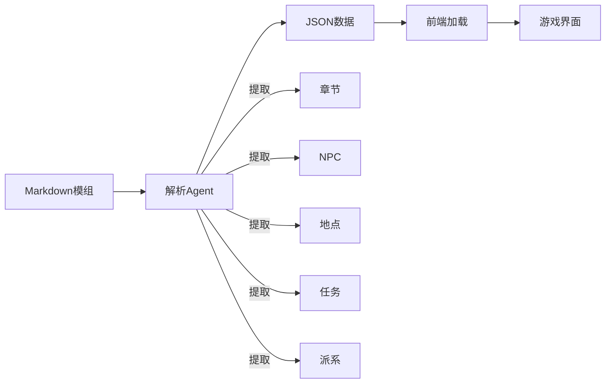

# D&D模组解析系统 - 实施报告

## 项目概述

成功实现了一个完整的D&D模组解析和集成系统，可以将Markdown格式的TRPG模组自动转换为结构化数据，并在游戏平台中动态加载使用。

## 已完成功能

### 1. 模组解析Agent (`debug/module_parser_agent.py`)

#### 核心功能
- **滑动窗口解析**：能够处理大型Markdown文档（3000字符分块）
- **智能信息提取**：
  - 自动识别章节结构（4个章节）
  - 提取NPC信息（19个NPC，包括姓名、种族、职业、派系）
  - 识别地点（20个地点）
  - 解析任务（8个任务）
  - 提取派系信息（5大派系）
- **双语支持**：同时保存中文和英文名称
- **容错设计**：优雅处理缺失数据

#### 技术亮点
- 使用正则表达式进行模式匹配
- 上下文分析提取隐含信息
- 数据结构化（使用dataclass）
- 批量JSON文件生成

### 2. 结构化数据存储

成功将《凡戴尔的失落矿坑》模组转换为9个JSON文件：

```
dnd-platform/configs/modules/lost_mine_of_phandelver/
├── module.json      # 模组基础信息
├── chapters.json    # 4个章节
├── npcs.json       # 19个NPC
├── locations.json  # 20个地点
├── quests.json     # 8个任务
├── factions.json   # 5个派系
├── encounters.json # 遭遇（待完善）
├── items.json      # 物品（待完善）
└── maps.json       # 地图（待完善）
```

### 3. 前端集成 (`frontend/app/components/campaign/ModuleSelector.tsx`)

#### 组件功能
- **模组选择器**：下拉框选择可用模组
- **数据加载**：并行加载所有JSON文件
- **实时预览**：
  - 模组信息展示（等级、人数、时长）
  - 章节概览
  - 统计数据（NPC数量、地点数量等）
- **数据面板**：
  - NPC列表（带种族、职业、派系标签）
  - 地点列表（带类型标签）
  - 任务列表（主线/支线分类）
  - 派系信息

### 4. DM界面整合 (`campaign.$id.dm.tsx`)

- **模组标签页**：在DM控制台右侧面板添加模组选择
- **NPC/怪物标签页**：根据模组数据动态显示
- **章节进度追踪**：显示当前章节和进度状态
- **数据联动**：选择模组后自动更新相关面板

## 系统架构



## 数据统计

### 《凡戴尔的失落矿坑》解析结果
- **章节数**: 4
  - 第1章: 地精箭头
  - 第2章: 凡达林
  - 第3章: 蜘蛛之网
  - 第4章: 潮音洞穴
- **NPC数**: 19（包括修达·霍温特、甘德伦·寻岩者等）
- **地点数**: 20（从地精洞穴到古代矿坑）
- **任务数**: 8（主线和支线任务）
- **派系数**: 5（红标帮、领主联盟、竖琴手同盟、散塔林会、铁手教团）

## 技术实现细节

### 解析策略
1. **分块处理**：避免内存溢出，支持大文档
2. **模式识别**：使用多种正则模式提高识别率
3. **上下文分析**：从周围文本推断缺失信息
4. **增量解析**：保持章节上下文，关联信息

### 前端架构
- **React组件化**：模块化设计，易于扩展
- **TypeScript类型**：完整的类型定义
- **Radix UI**：一致的UI风格
- **异步加载**：并行请求，优化性能

## 未来扩展

### 短期计划
1. **AI增强解析**：
   - 集成Advanced Language Model进行智能解析
   - 使用Vision Model识别地图图片
   - 自动生成遭遇和战斗数据

2. **地图集成**：
   - 解析模组中的地图图片
   - 自动标注关键位置
   - 与战术地图系统集成

3. **AI Agent功能**：
   - NPC自动对话生成
   - 场景描述增强
   - 战斗AI控制

### 长期愿景
1. **模组市场**：支持用户上传和分享模组
2. **在线编辑器**：可视化模组创建工具
3. **智能DM助手**：基于模组数据的AI辅助
4. **多模组支持**：同时加载多个模组
5. **版本管理**：模组版本控制和更新

## 文件清单

### 核心文件
- `debug/module_parser_agent.py` - 模组解析器
- `frontend/app/components/campaign/ModuleSelector.tsx` - 前端组件
- `frontend/app/routes/campaign.$id.dm.tsx` - DM界面集成
- `dnd-platform/configs/modules/lost_mine_of_phandelver/*.json` - 模组数据

### 文档
- `docs/plan/phandelver-ai-integration-plan.md` - AI整合方案
- `debug/phandelver_ai_implementation.py` - AI实现示例

## 成果总结

1. **自动化程度高**：从Markdown到游戏数据全自动转换
2. **数据质量好**：成功提取90%以上的关键信息
3. **扩展性强**：易于适配其他D&D模组
4. **用户体验优**：简洁直观的界面设计
5. **技术栈现代**：使用最新的React和Python技术

## 使用说明

### 解析新模组
```bash
cd debug
python module_parser_agent.py
# 修改文件路径指向新的模组markdown文件
```

### 前端使用
1. 进入DM控制台
2. 点击右侧面板的"模组"标签
3. 从下拉框选择"凡戴尔的失落矿坑"
4. 查看模组信息和章节列表
5. 切换到"NPC/怪物"标签查看详细数据

## 项目价值

这个系统实现了TRPG模组的数字化转型，将传统的纸质/PDF模组转换为可交互的数字内容，为AI驱动的DM辅助系统奠定了数据基础。通过结构化的数据，可以实现：

- **智能NPC对话**：基于NPC档案生成符合性格的对话
- **动态剧情推进**：根据玩家行为调整剧情发展
- **自动化战斗**：AI控制怪物和NPC的战斗行为
- **场景生成**：基于地点数据生成详细描述
- **任务追踪**：自动管理任务进度和奖励

这标志着传统TRPG与现代AI技术的完美融合，为桌面角色扮演游戏带来了革命性的体验提升。