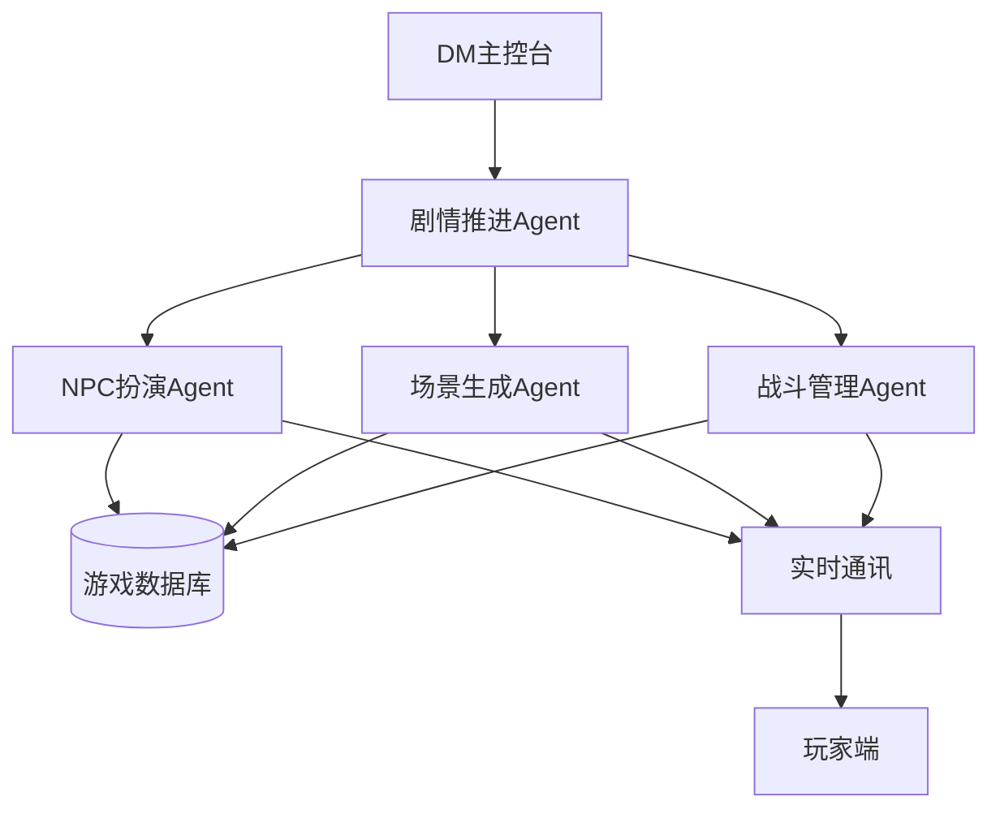

# 凡戴尔的失落矿坑 - AI Agent整合方案

## 一、模组结构分析

### 1.1 核心架构
- **4个章节**：地精箭头 → 凡达林镇 → 蜘蛛之网 → 潮音洞穴
- **20+重要NPC**：每个都有独特的背景、动机和信息
- **10+关键地点**：从地精洞穴到古代矿坑
- **5大派系**：红标帮、领主联盟、竖琴手同盟、散塔林会、铁手教团

### 1.2 剧情要素
- **主线剧情**：营救甘德伦，找回矿坑地图，对抗黑蜘蛛
- **支线任务**：清除兽人威胁、调查古枭井、寻找女妖等
- **随机遭遇**：地精伏击、红标帮骚扰、游荡怪物

## 二、AI Agent系统设计

### 2.1 核心Agent类型

#### 🎭 NPC扮演Agent
**功能设计**：
```javascript
{
  name: "NPC_Roleplay_Agent",
  capabilities: [
    "personality_simulation",  // 基于NPC背景模拟性格
    "information_management",   // 控制信息披露节奏
    "emotion_response",        // 情绪反应系统
    "relationship_tracking"    // 追踪与PC的关系
  ],
  npc_profiles: {
    "修达·霍温特": {
      personality: "正直、忠诚、经验丰富",
      knowledge: ["潮音洞穴历史", "领主联盟任务", "伊阿诺失踪"],
      goals: ["营救甘德伦", "建立秩序", "找到伊阿诺"],
      speech_pattern: "正式、军事化、直接"
    },
    "伊米克(地精)": {
      personality: "狡猾、野心勃勃、机会主义",
      knowledge: ["克拉格弱点", "洞穴布局", "甘德伦位置"],
      goals: ["推翻克拉格", "掌控部落", "获取财富"],
      speech_pattern: "粗鲁、威胁性、讨价还价"
    }
  }
}
```

#### 🗺️ 场景生成Agent
**功能设计**：
```javascript
{
  name: "Scene_Generator_Agent",
  capabilities: [
    "dynamic_description",     // 动态场景描述
    "atmosphere_control",       // 氛围控制
    "detail_enhancement",       // 细节增强
    "sensory_description"       // 感官描述
  ],
  scene_templates: {
    "克拉摩窝点": {
      base_description: "潮湿阴暗的洞穴...",
      dynamic_elements: [
        "根据时间变化的光线",
        "基于PC行动的声音反馈",
        "随机环境细节（滴水声、回声等）"
      ],
      danger_level: "medium",
      discovery_points: ["隐藏宝箱", "秘密通道", "环境线索"]
    }
  }
}
```

#### ⚔️ 战斗管理Agent
**功能设计**：
```javascript
{
  name: "Combat_Manager_Agent",
  capabilities: [
    "tactical_ai",              // 战术AI
    "dynamic_difficulty",       // 动态难度调整
    "narrative_combat",         // 叙事化战斗
    "creature_behavior"         // 生物行为模拟
  ],
  combat_strategies: {
    "地精": {
      tactics: ["伏击", "游击战", "使用地形优势"],
      morale: "低 - 容易逃跑",
      coordination: "基础协作"
    },
    "熊地精克拉格": {
      tactics: ["正面强攻", "召唤援军", "狂暴攻击"],
      morale: "高 - 战斗到底",
      special_moves: ["投掷标枪", "战吼威吓"]
    }
  }
}
```

#### 📖 剧情推进Agent
**功能设计**：
```javascript
{
  name: "Plot_Director_Agent",
  capabilities: [
    "story_pacing",            // 节奏控制
    "plot_branching",          // 剧情分支
    "consequence_tracking",    // 后果追踪
    "foreshadowing"           // 伏笔铺设
  ],
  story_states: {
    current_chapter: 1,
    key_events_completed: [],
    player_choices: [],
    upcoming_events: ["红标帮遭遇", "修达获救"],
    black_spider_awareness: 0  // 黑蜘蛛对PC的了解程度
  }
}
```

### 2.2 Agent协作系统



## 三、平台整合方案

### 3.1 数据结构设计

```typescript
// 模组数据结构
interface PhandelverModule {
  id: string;
  name: "凡戴尔的失落矿坑";
  chapters: Chapter[];
  npcs: NPC[];
  locations: Location[];
  encounters: Encounter[];
  items: Item[];
  factions: Faction[];
}

// NPC数据结构
interface NPC {
  id: string;
  name: string;
  race: string;
  class?: string;
  stats: CharacterStats;
  personality: PersonalityTraits;
  knowledge: string[];
  secrets: string[];
  relationships: Relationship[];
  aiProfile: AIProfile;  // AI扮演配置
}

// 地点数据结构
interface Location {
  id: string;
  name: string;
  description: string;
  mapData?: MapData;  // 战术地图数据
  npcs: string[];     // NPC ID列表
  encounters: string[]; // 遭遇ID列表
  secrets: Discovery[]; // 可发现的秘密
  connections: string[]; // 连接的其他地点
}
```

### 3.2 实时功能集成

#### 战术地图系统
```javascript
// 整合现有的Konva地图系统
const TacticalMapIntegration = {
  // 预设地图
  maps: {
    "cragmaw_hideout": {
      gridSize: 40, // 40px = 5feet
      rooms: [...],
      lighting: "dark",
      fog_of_war: true
    }
  },

  // AI控制的动态元素
  dynamicElements: {
    npcMovement: true,     // NPC自主移动
    trapTriggers: true,    // 陷阱触发
    environmentalEffects: true // 环境效果
  }
};
```

#### 实时通讯增强
```javascript
// WebSocket消息类型扩展
const WSMessageTypes = {
  // 现有类型
  chat: "chat",
  map_update: "map_update",
  dice_roll: "dice_roll",

  // 新增AI驱动类型
  npc_dialogue: "npc_dialogue",      // NPC对话
  scene_description: "scene_description", // 场景描述
  plot_event: "plot_event",          // 剧情事件
  ai_suggestion: "ai_suggestion"     // AI建议
};
```

### 3.3 DM辅助功能

#### 智能提示系统
```javascript
const DMAssistant = {
  // 实时提示
  contextualHints: {
    "玩家询问甘德伦": "提醒：甘德伦已被送往克拉摩堡",
    "进入凡达林": "建议：描述红标帮的威胁氛围",
    "战斗开始": "提示：地精会使用游击战术"
  },

  // 自动生成
  autoGenerate: {
    npcResponses: true,    // NPC回应
    combatNarration: true, // 战斗叙述
    lootGeneration: true,  // 战利品生成
    randomEncounters: true // 随机遭遇
  },

  // 规则提醒
  ruleReminders: {
    "地精隐匿": "记住：地精有+6隐匿加值",
    "洪水陷阱": "DC 10敏捷豁免，失败受1d6伤害"
  }
};
```

### 3.4 AI Agent配置界面

```typescript
// DM配置面板
interface AIConfigPanel {
  npcAutonomy: {
    level: "low" | "medium" | "high";  // NPC自主程度
    personalityStrength: number;        // 性格强度 0-100
    informationControl: "strict" | "flexible"; // 信息控制
  };

  combatAI: {
    difficulty: "easy" | "normal" | "hard";
    tacticalLevel: number;  // 战术智能 0-100
    adaptiveDifficulty: boolean; // 自适应难度
  };

  narrativeStyle: {
    descriptionDetail: "minimal" | "moderate" | "rich";
    tone: "serious" | "balanced" | "humorous";
    pacing: "slow" | "normal" | "fast";
  };
}
```

## 四、特色功能实现

### 4.1 动态NPC系统

```javascript
class DynamicNPC {
  constructor(npcData) {
    this.base = npcData;
    this.memory = [];  // 记忆系统
    this.mood = "neutral"; // 情绪状态
    this.relationship = {}; // 关系网络
  }

  // AI驱动的对话生成
  async generateResponse(context) {
    const response = await AIService.chat({
      model: "advanced_language_model",
      system: this.getPersonalityPrompt(),
      context: this.getRelevantMemory(context),
      input: context.playerInput
    });

    this.updateMemory(context);
    this.updateMood(response);
    return response;
  }

  // 信息管理
  shouldRevealInformation(info, context) {
    // 基于关系、情绪、剧情进度决定是否透露信息
    const factors = {
      relationship: this.relationship[context.playerId] || 0,
      mood: this.moodValue(),
      plotRelevance: this.calculateRelevance(info, context),
      playerActions: context.recentActions
    };

    return this.calculateRevealProbability(factors) > 0.5;
  }
}
```

### 4.2 智能遭遇生成

```javascript
class EncounterGenerator {
  // 基于剧情和玩家行为生成遭遇
  generateEncounter(context) {
    const factors = {
      location: context.currentLocation,
      playerLevel: context.partyLevel,
      plotStage: context.chapterProgress,
      recentEvents: context.history,
      timeOfDay: context.gameTime
    };

    // AI分析并生成合适的遭遇
    return AIService.generateEncounter({
      type: this.selectEncounterType(factors),
      difficulty: this.calculateDifficulty(factors),
      narrative: this.generateNarrative(factors),
      rewards: this.generateRewards(factors)
    });
  }
}
```

### 4.3 剧情分支管理

```javascript
class PlotBranchManager {
  // 追踪玩家选择的后果
  trackConsequences(action) {
    const consequences = {
      "杀死伊米克": {
        immediate: "地精群龙无首，陷入混乱",
        future: "克拉格加强防备"
      },
      "与伊米克合作": {
        immediate: "获得克拉格位置信息",
        future: "伊米克可能背叛"
      },
      "忽视红标帮": {
        immediate: "镇民失望",
        future: "红标帮势力增强"
      }
    };

    this.applyConsequence(consequences[action]);
    this.updateWorldState(action);
  }
}
```

## 五、实施步骤

### 第一阶段：基础整合（1-2周）
1. 导入模组数据到数据库
2. 创建NPC和地点的基础数据结构
3. 实现简单的NPC对话Agent

### 第二阶段：AI功能开发（2-3周）
1. 开发NPC扮演Agent
2. 实现场景生成Agent
3. 构建战斗管理Agent
4. 创建剧情推进Agent

### 第三阶段：界面集成（1-2周）
1. DM控制面板UI
2. Agent配置界面
3. 实时提示系统
4. 玩家交互优化

### 第四阶段：测试优化（1周）
1. 内部测试运行
2. AI行为调优
3. 性能优化
4. Bug修复

## 六、预期效果

### DM体验提升
- **减负80%**：自动处理NPC对话、战斗叙述、场景描述
- **创意增强**：AI提供灵感和建议，但DM保持最终控制权
- **节奏把控**：智能调整剧情节奏，确保游戏流畅

### 玩家体验提升
- **沉浸感**：生动的NPC互动和场景描述
- **响应性**：即时的世界反馈和后果体现
- **个性化**：基于玩家行为的定制化体验

### 平台特色
- **智能化**：业界领先的AI驱动TRPG体验
- **易用性**：新手DM也能运行专业级游戏
- **扩展性**：系统可适配其他模组

## 七、技术要点

### API调用优化
```javascript
// 批量处理AI请求
const batchAIRequests = async (requests) => {
  const batches = chunk(requests, 5); // 每批5个请求
  const results = [];

  for (const batch of batches) {
    const batchResults = await Promise.all(
      batch.map(req => AIService.process(req))
    );
    results.push(...batchResults);
  }

  return results;
};
```

### 缓存策略
```javascript
// NPC响应缓存
const npcResponseCache = new Map();

const getCachedResponse = (npcId, context) => {
  const cacheKey = `${npcId}-${hashContext(context)}`;

  if (npcResponseCache.has(cacheKey)) {
    const cached = npcResponseCache.get(cacheKey);
    if (Date.now() - cached.timestamp < 3600000) { // 1小时有效
      return cached.response;
    }
  }

  return null;
};
```

### 安全考虑
```javascript
// AI输出过滤
const filterAIOutput = (output) => {
  // 过滤不适当内容
  const filtered = contentFilter.check(output);

  // 确保符合D&D设定
  const validated = loreValidator.validate(filtered);

  // 长度限制
  const truncated = truncateToLimit(validated, 500);

  return truncated;
};
```

## 八、总结

这个整合方案将《凡戴尔的失落矿坑》转化为一个AI驱动的智能冒险模组，通过多个专门的Agent协同工作，为DM提供强大的辅助功能，同时为玩家创造更加生动和响应式的游戏体验。系统保持了模组的核心魅力，同时注入了现代AI技术的活力，真正实现了传统TRPG与AI技术的完美融合。