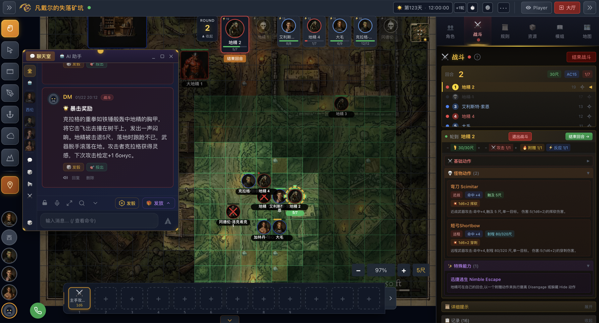
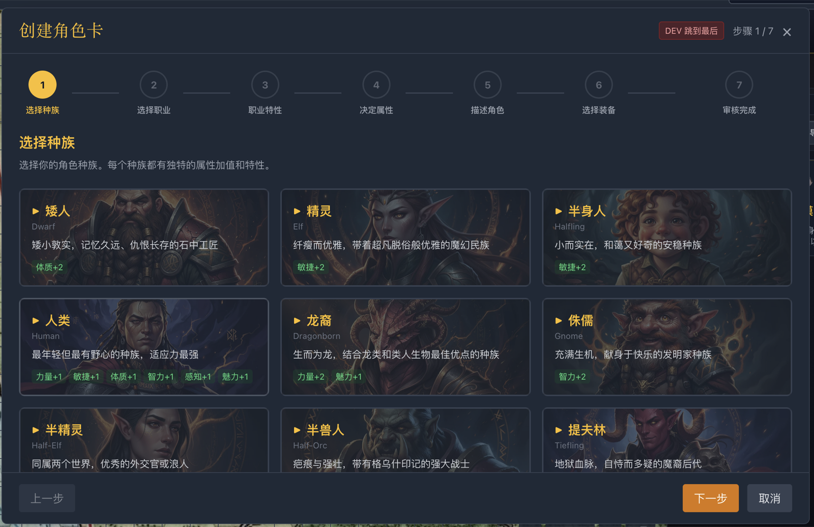
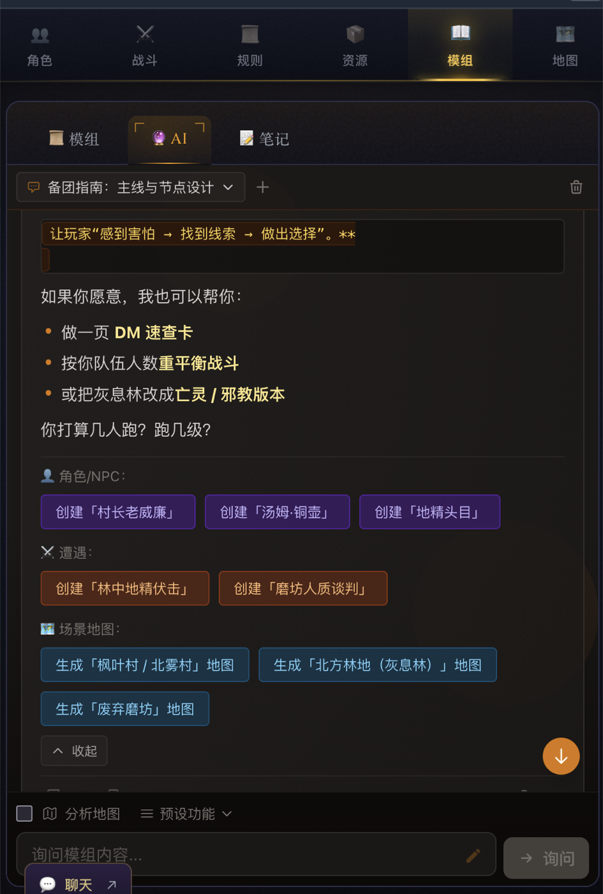
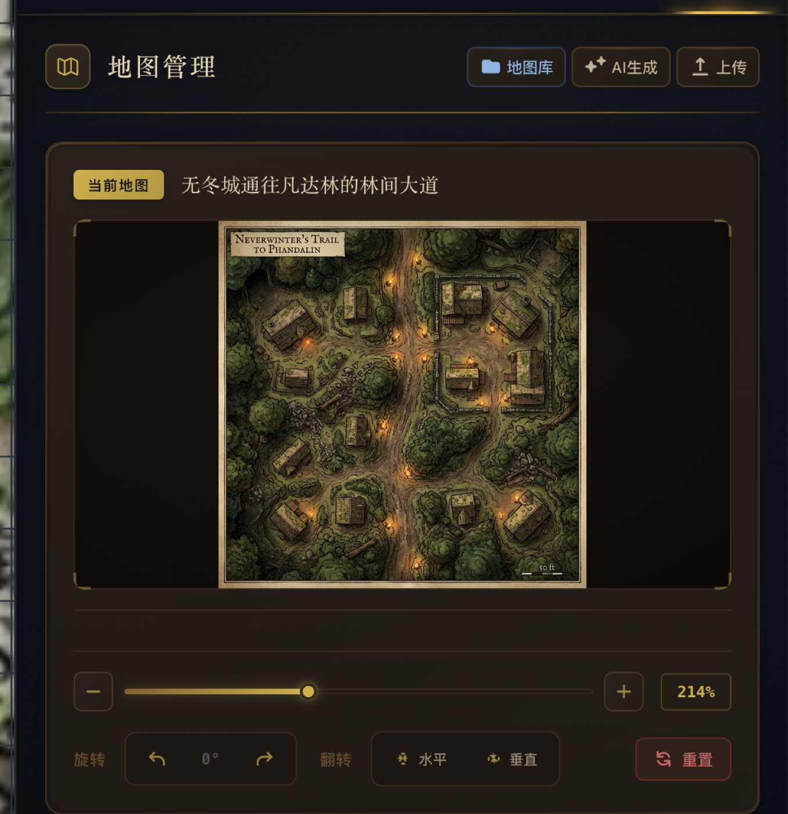
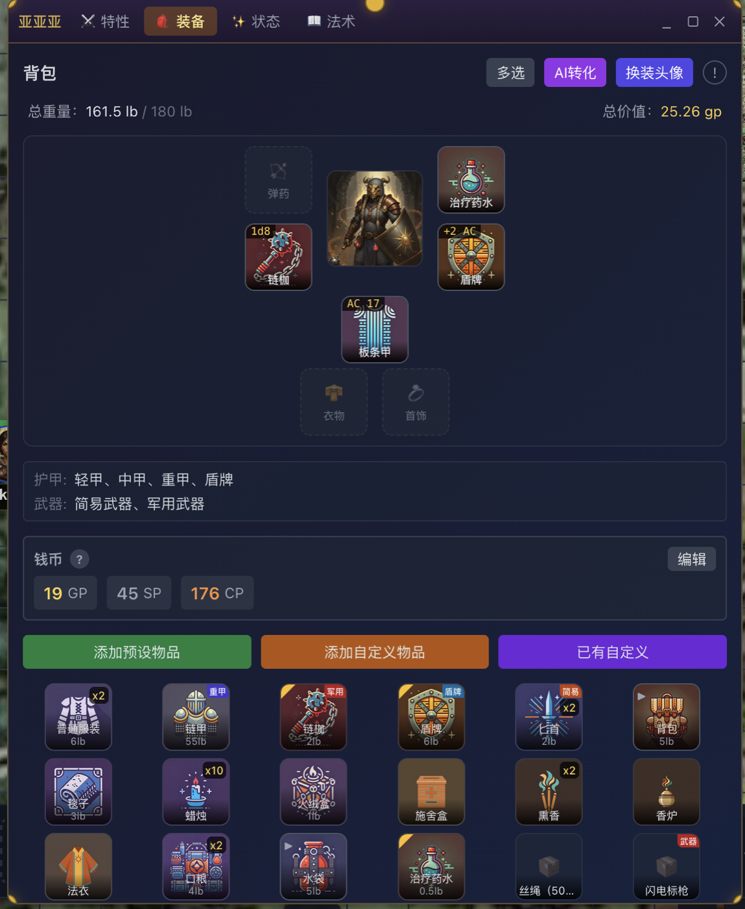
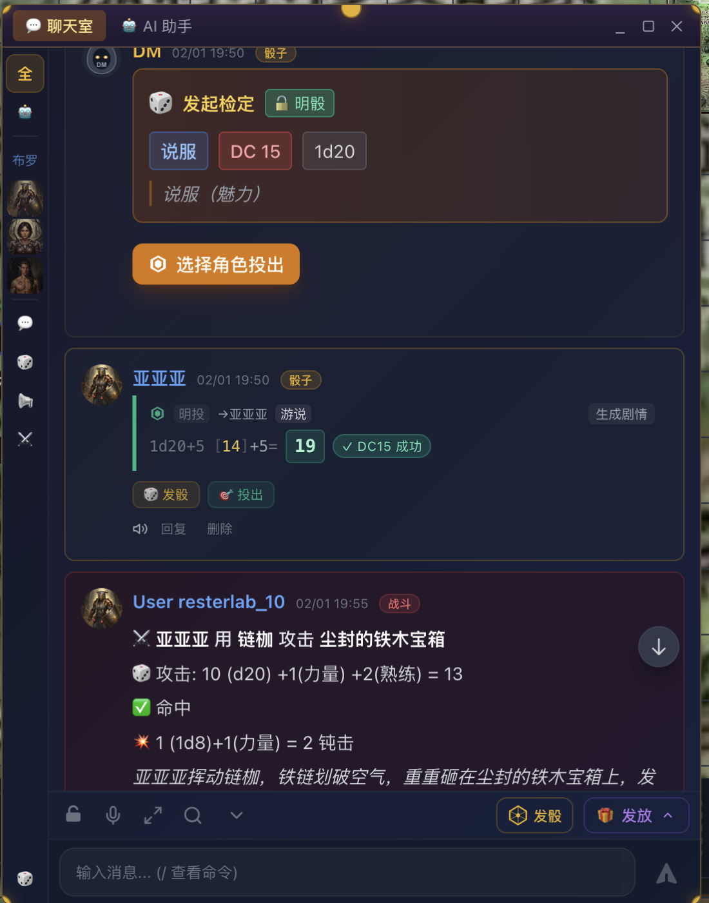

# Deepwood DND Showcase / 产品展示

Deepwood DND is a full-stack virtual tabletop for D&D-style campaigns: campaign
operations, character creation, tactical combat, assets, module preparation,
rules lookup, and AI-assisted DM workflows in one interface.

Deepwood DND 是一个面向 D&D 风格战役的全栈虚拟桌面：把战役运营、角色创建、
战术战斗、资产管理、模组准备、规则检索和 AI 辅助 DM 工作流放在同一个界面里。

> Deepwood DND provides product/software code. D&D content rights, commercial
> content rights, and third-party asset rights are separate; see
> [`LEGAL.md`](../LEGAL.md) and [`NOTICE.md`](../NOTICE.md).
>
> Deepwood DND 提供的是产品和软件代码，不提供 D&D 内容、商业化内容或第三方素材
> 权利；详见 [`LEGAL.md`](../LEGAL.md) 和 [`NOTICE.md`](../NOTICE.md)。

## Live Tabletop / 实时战术桌面

- Real-time tactical map with grid, tokens, fog/visibility, movement distance,
  zoom, initiative order, and encounter state.
- DM/player chat is part of the table, so combat narration, checks, rewards,
  and adjudication stay attached to the session.
- The combat side panel exposes HP, AC, movement, actions, attacks, reactions,
  and special abilities for the selected creature.

- 实时战术地图支持网格、棋子、视野/遮蔽、移动距离、缩放、先攻顺序和遭遇状态。
- 聊天室与桌面合一，战斗叙事、检定、奖励和裁定都留在同一个战役上下文中。
- 战斗侧栏会展示当前角色/怪物的 HP、AC、速度、动作、攻击、反应和特殊能力。

## Character Builder / 自动角色创建

- Step-by-step character creation: race, class, class features, attributes,
  role description, equipment, and final review.
- Character math is calculated automatically where possible: ability bonuses,
  derived resources, equipment constraints, and character sheet data.
- The flow is built for players and DMs who want a playable character sheet
  without manually wiring every formula.

- 分步骤创建角色：种族、职业、职业特性、属性、角色描述、装备和最终审核。
- 尽可能自动计算角色数值：属性加值、派生资源、装备约束和角色卡数据。
- 目标是让玩家和 DM 不必手动维护所有公式，也能得到可直接游玩的角色卡。

## AI Module Prep / AI 读规则、读模组与备团

- AI can read rules/module context and help the DM prepare playable material:
  quick DM reference cards, balance suggestions, NPCs, encounters, and maps.
- Module chat can turn a prep note into concrete assets, such as villagers,
  rumors, goblin ambushes, abandoned workshops, or forest-route maps.
- The workflow keeps AI output close to campaign assets instead of leaving it
  in a disconnected chat window.

- AI 可以读取规则和模组上下文，帮助 DM 准备可直接使用的材料：速查卡、战斗平衡、
  NPC、遭遇、地图等。
- 模组 AI 可以把备团笔记转成实际资产，例如村民、传闻、地精伏击、废弃磨坊、
  林道地图。
- AI 结果直接贴近战役资产，不只是停留在孤立聊天窗口里。

## Map Assets / 地图资产管理与 AI 生成

- Map management includes library browsing, upload, AI generation, scaling,
  rotation, flipping, and reset controls.
- Maps can become playable battlefields after alignment and scale setup.
- This supports both prepared modules and improvised sessions where the DM
  needs a new scene quickly.

- 地图管理支持地图库、上传、AI 生成、缩放、旋转、翻转和重置。
- 地图经过比例和对齐后可以直接成为可游玩的战斗场景。
- 既适合预先准备的模组，也适合 DM 临场需要快速生成新场景。

## Assets & Inventory / 资产与装备管理

- Inventory tracks equipment slots, backpack contents, item quantities, weight,
  value, currency, armor/weapon categories, and custom items.
- Asset tools include AI item transformation and avatar replacement workflows.
- The same asset model supports player characters, NPCs, monsters, treasure,
  chests, and generated campaign resources.

- 背包系统跟踪装备槽、背包物品、数量、重量、价值、货币、护甲/武器分类和自定义物品。
- 资产工具支持 AI 转化物品、替换头像等工作流。
- 同一套资产模型可服务于玩家角色、NPC、怪物、宝箱、战利品和 AI 生成的战役资源。

## Dice Automation / 骰子与规则自动计算

- Checks and attacks resolve with visible math: d20, modifiers, proficiency,
  DC comparison, hit/miss, damage dice, and narration.
- The DM can request a specific skill check and let players choose who rolls.
- Combat rolls can produce adjudicated results and narrative output in the chat.

- 检定和攻击会展示可审计的计算过程：d20、修正值、熟练项、DC 对比、命中/未命中、
  伤害骰和叙事结果。
- DM 可以发起指定技能检定，让玩家选择角色投出。
- 战斗掷骰可以生成裁定结果和聊天叙事。

## AI-Generated Campaign Assets / AI 实时生成战役资产

Deepwood DND is designed around a DM workflow where AI can assist with concrete
campaign objects, not just prose:

- monsters and monster actions
- NPCs, portraits, rumors, and scene hooks
- chests, treasure, equipment, and consumables
- encounters and balancing suggestions
- battle maps and scene maps
- module summaries, notes, and DM-facing prep cards

Deepwood DND 的 AI 工作流面向“可用资产”，不只是生成一段文字：

- 怪物与怪物动作
- NPC、头像、传闻和场景钩子
- 宝箱、战利品、装备和消耗品
- 遭遇与战斗平衡建议
- 战斗地图与场景地图
- 模组摘要、笔记和 DM 备团速查卡

## Commercial and Content Boundary / 商业化与内容边界

The Deepwood DND software is Apache-2.0 licensed. That does not grant rights to
D&D rules text, official books, adventures, art, maps, trademarks, Product
Identity, uploaded modules, generated campaign content, or third-party assets.
Commercial deployments must independently satisfy the applicable Wizards/SRD/OGL
/ Fan Content Policy and third-party content requirements.

Deepwood DND 软件代码使用 Apache-2.0。该协议不授权 D&D 规则文本、官方书籍、
冒险、美术、地图、商标、Product Identity、上传模组、生成战役内容或第三方资产。
如果用于商业化部署，需要自行符合 Wizards/SRD/OGL/Fan Content Policy 以及
第三方内容要求。
