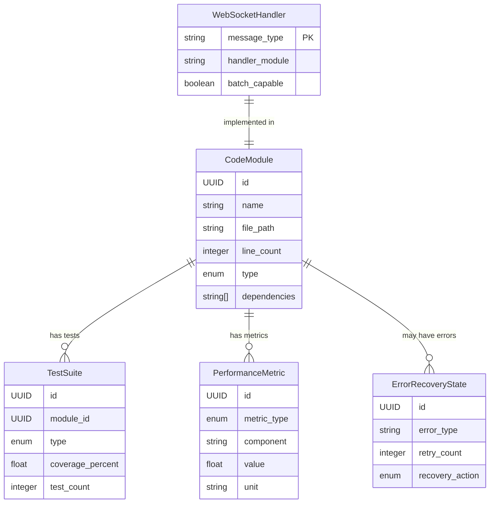

# Data Model: Project Optimization

**Feature**: Project Optimization and Issue Resolution
**Date**: 2025-11-20

## Entity Definitions

### CodeModule
Represents a logical unit of refactored code

**Fields**:
- `id`: UUID - Unique identifier
- `name`: string - Module name (e.g., "token_handler", "character_service")
- `file_path`: string - Path to the module file
- `line_count`: integer - Current line count (must be <= 400)
- `type`: enum - MODULE_TYPE (handler, service, component, route, utility)
- `dependencies`: string[] - List of imported modules
- `last_refactored`: timestamp - When last refactored
- `original_file`: string - Source file before refactoring

**Validations**:
- line_count MUST be <= 400
- name MUST follow naming convention (snake_case for Python, camelCase for TS)
- file_path MUST exist in repository

**State Transitions**:
- monolithic → splitting → refactored → validated

### TestSuite
Collection of tests for a module or feature

**Fields**:
- `id`: UUID - Unique identifier
- `module_id`: UUID - Related code module (nullable for integration tests)
- `type`: enum - TEST_TYPE (unit, integration, e2e)
- `coverage_percent`: float - Code coverage percentage
- `test_count`: integer - Number of test cases
- `passing_count`: integer - Number of passing tests
- `file_path`: string - Path to test file
- `last_run`: timestamp - Last execution time
- `execution_time_ms`: integer - Test runtime in milliseconds

**Validations**:
- coverage_percent MUST be between 0 and 100
- passing_count <= test_count
- file_path MUST be in tests/ or debug/ directory

**State Transitions**:
- pending → running → passed/failed

### PerformanceMetric
Measurable performance data point

**Fields**:
- `id`: UUID - Unique identifier
- `metric_type`: enum - METRIC_TYPE (fps, latency, query_count, response_time)
- `component`: string - Component being measured
- `value`: float - Measured value
- `unit`: string - Unit of measurement (fps, ms, count)
- `threshold`: float - Acceptable threshold
- `measured_at`: timestamp - When measured
- `environment`: enum - ENVIRONMENT (development, staging, production)
- `context`: JSON - Additional context (e.g., token count, user count)

**Validations**:
- value MUST be positive
- threshold MUST be defined for metric_type
- unit MUST match metric_type

### ErrorRecoveryState
Information for error recovery and retry logic

**Fields**:
- `id`: UUID - Unique identifier
- `error_type`: string - Type of error
- `component`: string - Where error occurred
- `retry_count`: integer - Number of retry attempts
- `max_retries`: integer - Maximum allowed retries
- `backoff_ms`: integer - Current backoff delay
- `recovery_action`: enum - RECOVERY_ACTION (retry, refresh, fallback, manual)
- `context`: JSON - Error context and stack trace
- `created_at`: timestamp - When error first occurred
- `resolved_at`: timestamp - When error was resolved (nullable)

**Validations**:
- retry_count <= max_retries
- backoff_ms follows exponential pattern (2^n * 100)
- recovery_action MUST have handler implementation

**State Transitions**:
- new → retrying → resolved/failed

### WebSocketHandler
Registry entry for WebSocket message handlers

**Fields**:
- `message_type`: string - Type of WebSocket message (primary key)
- `handler_module`: string - Module containing handler
- `handler_class`: string - Handler class name
- `avg_processing_ms`: float - Average processing time
- `message_count`: integer - Total messages processed
- `error_count`: integer - Total errors encountered
- `last_used`: timestamp - Last message processed
- `batch_capable`: boolean - Supports message batching

**Validations**:
- message_type MUST be unique
- handler_module MUST exist and be < 400 lines
- handler_class MUST implement BaseHandler interface

## Relationships

## Constraints

### Business Rules
1. No CodeModule can exceed 400 lines
2. TestSuite coverage must reach 80% for backend, 70% for frontend
3. PerformanceMetric FPS must stay above 30, ideally 60
4. WebSocketHandler processing must complete within 50ms
5. ErrorRecoveryState retries use exponential backoff with jitter

### Data Integrity
1. Module dependencies must form a DAG (no circular dependencies)
2. Test files must correspond to actual module files
3. Performance metrics must be collected in consistent environments
4. Handler registry must have exactly one handler per message type

## Migration Notes

These entities are primarily for tracking and validation during the optimization process. They may be:
- Stored in a temporary optimization database
- Tracked via code analysis tools
- Maintained in configuration files
- Used for build-time validation

The actual refactored code remains in the source files following the patterns defined here.