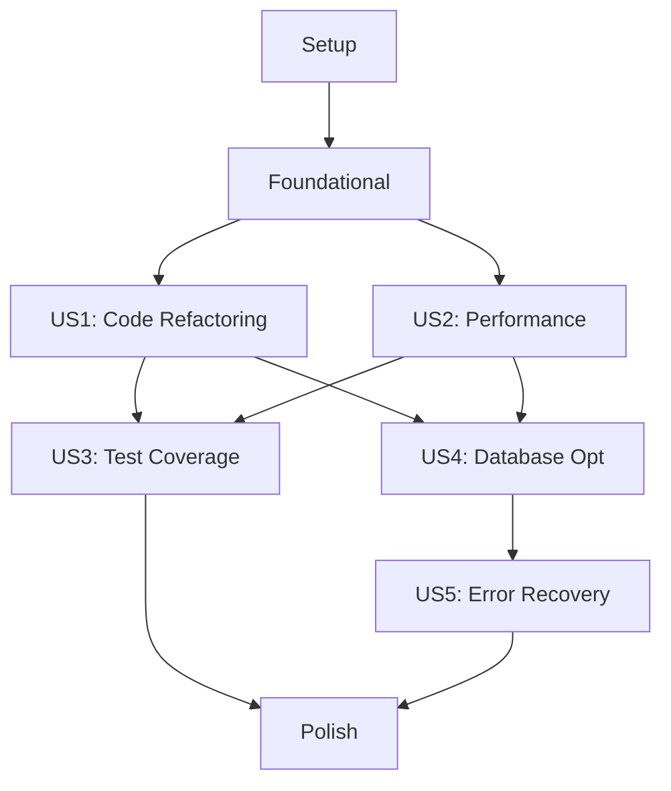

# Implementation Tasks: Project Optimization and Issue Resolution

**Branch**: 003-project-optimization
**Spec**: [spec.md](spec.md)
**Plan**: [plan.md](plan.md)
**Generated**: 2025-11-20

## Summary

This task list implements comprehensive optimization across the D&D platform, organized by user story to enable independent development and testing. Each story delivers specific value and can be completed independently.

**Task Breakdown**:
- Total tasks: 78
- Setup tasks: 7
- Foundational tasks: 5
- US1 (Code Refactoring): 18 tasks
- US2 (Performance Optimization): 15 tasks
- US3 (Test Coverage): 11 tasks
- US4 (Database Optimization): 10 tasks
- US5 (Error Recovery): 8 tasks
- Polish tasks: 4

**Parallel Opportunities**: 45 tasks marked [P] can run in parallel within their phases

## Phase 1: Setup

**Goal**: Initialize project infrastructure for optimization tracking

- [ ] T001 Create optimization tracking infrastructure directories
- [ ] T002 [P] Install Python dependencies: pytest-cov, pytest-asyncio, pytest-mock in backend/requirements-dev.txt
- [ ] T003 [P] Install frontend dependencies: @testing-library/react, vitest in frontend/package.json
- [ ] T004 [P] Create backend/scripts/analyze_code.py for file size analysis
- [ ] T005 [P] Create backend/scripts/refactor_websocket.py for handler extraction
- [ ] T006 [P] Create frontend/scripts/analyze_components.js for component analysis
- [ ] T007 Configure pytest.ini with coverage targets (80% backend, 70% frontend)

## Phase 2: Foundational

**Goal**: Set up monitoring and analysis tools needed by all user stories

- [ ] T008 Implement CodeModule tracking entity in backend/app/models/optimization.py
- [ ] T009 Implement PerformanceMetric entity in backend/app/models/optimization.py
- [ ] T010 Create optimization API base router in backend/app/api/routes/optimization.py
- [ ] T011 Set up performance monitoring middleware in backend/app/middleware/metrics.py
- [ ] T012 Create frontend performance monitoring hook in frontend/app/hooks/usePerformanceMetrics.ts

## Phase 3: User Story 1 - Code Refactoring and Modularization (P1)

**Story Goal**: Refactor all files to under 400 lines with clear module separation
**Independent Test**: Run analyze_code.py and verify no files exceed 400 lines

### Implementation Tasks

- [ ] T013 [US1] Analyze backend/app/api/routes/websocket.py (959 lines) for splitting points
- [ ] T014 [US1] Create backend/app/api/websocket/handlers/ directory structure
- [ ] T015 [P] [US1] Extract TokenMoveHandler to backend/app/api/websocket/handlers/token.py
- [ ] T016 [P] [US1] Extract ChatHandler to backend/app/api/websocket/handlers/chat.py
- [ ] T017 [P] [US1] Extract DiceHandler to backend/app/api/websocket/handlers/dice.py
- [ ] T018 [P] [US1] Extract MapHandler to backend/app/api/websocket/handlers/map.py
- [ ] T019 [P] [US1] Extract CharacterHandler to backend/app/api/websocket/handlers/character.py
- [ ] T020 [US1] Create handler registry in backend/app/api/websocket/registry.py
- [ ] T021 [US1] Refactor main WebSocket endpoint in backend/app/api/routes/websocket.py to use registry
- [ ] T022 [US1] Analyze backend/app/api/routes/modules.py (1387 lines) for splitting
- [ ] T023 [P] [US1] Extract module upload logic to backend/app/services/module_upload.py
- [ ] T024 [P] [US1] Extract module parsing logic to backend/app/services/module_parser.py
- [ ] T025 [P] [US1] Extract module status logic to backend/app/services/module_status.py
- [ ] T026 [US1] Refactor backend/app/api/routes/modules.py to use extracted services
- [ ] T027 [US1] Analyze frontend/app/components/ui/ChatPanel.tsx (1675 lines)
- [ ] T028 [P] [US1] Extract ChatMessage component to frontend/app/components/chat/ChatMessage.tsx
- [ ] T029 [P] [US1] Extract ChatInput component to frontend/app/components/chat/ChatInput.tsx
- [ ] T030 [US1] Refactor ChatPanel.tsx to use extracted components

## Phase 4: User Story 2 - Performance Optimization (P1)

**Story Goal**: Achieve 60 FPS with 150+ tokens and <50ms WebSocket latency
**Independent Test**: Load map with 150 tokens, measure FPS and latency metrics

### Implementation Tasks

- [ ] T031 [US2] Implement ViewportCuller class in frontend/app/utils/ViewportCuller.ts
- [ ] T032 [US2] Integrate viewport culling in frontend/app/components/map/TacticalMap.client.tsx
- [ ] T033 [P] [US2] Implement QuadTree spatial indexing in frontend/app/utils/QuadTree.ts
- [ ] T034 [US2] Add React.memo to token components in frontend/app/components/map/Token.tsx
- [ ] T035 [P] [US2] Implement useMemo for expensive calculations in frontend/app/hooks/useMapData.ts
- [ ] T036 [US2] Create WebSocket message batcher in backend/app/services/websocket_batcher.py
- [ ] T037 [US2] Configure 50ms batch window in backend/app/core/config.py
- [ ] T038 [US2] Integrate batching in backend/app/services/websocket_manager.py
- [ ] T039 [P] [US2] Add performance metrics collection to WebSocket handlers
- [ ] T040 [P] [US2] Create performance dashboard component in frontend/app/components/admin/PerformanceMonitor.tsx
- [ ] T041 [US2] Implement FPS counter in frontend/app/components/map/FPSCounter.tsx
- [ ] T042 [P] [US2] Add requestAnimationFrame optimization to token movement
- [ ] T043 [P] [US2] Implement canvas layer separation for static vs dynamic elements
- [ ] T044 [US2] Add performance metrics endpoint in backend/app/api/routes/optimization.py
- [ ] T045 [US2] Create performance benchmark script in backend/scripts/benchmark_performance.py

## Phase 5: User Story 3 - Test Coverage Enhancement (P2)

**Story Goal**: Achieve 80% backend and 70% frontend test coverage
**Independent Test**: Run coverage reports and verify targets are met

### Implementation Tasks

- [ ] T046 [US3] Create test fixtures in backend/tests/fixtures/optimization.py
- [ ] T047 [P] [US3] Write unit tests for TokenMoveHandler in backend/tests/unit/test_token_handler.py
- [ ] T048 [P] [US3] Write unit tests for ChatHandler in backend/tests/unit/test_chat_handler.py
- [ ] T049 [P] [US3] Write unit tests for WebSocket registry in backend/tests/unit/test_websocket_registry.py
- [ ] T050 [P] [US3] Write integration tests for optimization API in backend/tests/integration/test_optimization_api.py
- [ ] T051 [P] [US3] Write component tests for ViewportCuller in frontend/tests/unit/ViewportCuller.test.ts
- [ ] T052 [P] [US3] Write component tests for refactored ChatPanel in frontend/tests/components/ChatPanel.test.tsx
- [ ] T053 [P] [US3] Write E2E test for map performance in frontend/tests/e2e/map-performance.spec.ts
- [ ] T054 [US3] Configure coverage reporting in backend/pytest.ini
- [ ] T055 [US3] Configure coverage reporting in frontend/vitest.config.ts
- [ ] T056 [US3] Create coverage monitoring script in scripts/check_coverage.sh

## Phase 6: User Story 4 - Database Query Optimization (P2)

**Story Goal**: Eliminate N+1 queries and reduce database load by 60%
**Independent Test**: Monitor query counts for common operations, verify reduction

### Implementation Tasks

- [ ] T057 [US4] Add selectinload imports to backend/app/api/routes/characters.py
- [ ] T058 [US4] Optimize character equipment loading queries in backend/app/api/routes/characters.py
- [ ] T059 [US4] Optimize campaign data retrieval in backend/app/api/routes/campaigns.py
- [ ] T060 [P] [US4] Implement query batching in backend/app/services/database_optimizer.py
- [ ] T061 [P] [US4] Add Redis caching layer in backend/app/services/cache_service.py
- [ ] T062 [US4] Configure Redis connection in backend/app/core/redis.py
- [ ] T063 [P] [US4] Implement cache invalidation strategy in backend/app/services/cache_service.py
- [ ] T064 [US4] Add query performance logging in backend/app/middleware/query_logger.py
- [ ] T065 [P] [US4] Create database query analyzer in backend/scripts/analyze_queries.py
- [ ] T066 [US4] Add query optimization tests in backend/tests/integration/test_query_optimization.py

## Phase 7: User Story 5 - Error Recovery and Resilience (P3)

**Story Goal**: Implement structured errors with recovery actions and retry logic
**Independent Test**: Simulate errors and verify recovery mechanisms work

### Implementation Tasks

- [ ] T067 [US5] Create GameError class hierarchy in frontend/app/utils/errors.ts
- [ ] T068 [US5] Create structured error types in backend/app/exceptions/optimization.py
- [ ] T069 [P] [US5] Implement exponential backoff utility in backend/app/utils/retry.py
- [ ] T070 [P] [US5] Implement exponential backoff utility in frontend/app/utils/retry.ts
- [ ] T071 [US5] Add error recovery to WebSocket handlers in backend/app/api/websocket/handlers/
- [ ] T072 [US5] Add error recovery UI component in frontend/app/components/ErrorRecovery.tsx
- [ ] T073 [P] [US5] Implement error reporting endpoint in backend/app/api/routes/optimization.py
- [ ] T074 [US5] Add error recovery tests in backend/tests/unit/test_error_recovery.py

## Phase 8: Polish & Integration

**Goal**: Final integration, documentation, and deployment preparation

- [ ] T075 Update CLAUDE.md with optimization patterns and best practices
- [ ] T076 [P] Create optimization dashboard in frontend/app/routes/admin/optimization.tsx
- [ ] T077 [P] Add feature flags for gradual rollout in backend/app/core/feature_flags.py
- [ ] T078 Create rollback procedures document in docs/rollback.md

## Dependencies



## Parallel Execution Examples

### User Story 1 - Code Refactoring (T015-T019 can run in parallel)
```bash
# Terminal 1
python scripts/extract_handler.py --type token

# Terminal 2
python scripts/extract_handler.py --type chat

# Terminal 3
python scripts/extract_handler.py --type dice
```

### User Story 2 - Performance (T033, T035, T039, T040 can run in parallel)
```bash
# Different team members can work on:
- Frontend viewport culling (T031-T032)
- Backend message batching (T036-T038)
- Performance monitoring (T039-T041)
```

### User Story 3 - Testing (T047-T052 can all run in parallel)
```bash
# Parallel test writing
pytest backend/tests/unit/test_token_handler.py &
pytest backend/tests/unit/test_chat_handler.py &
npm test frontend/tests/components/
```

## Implementation Strategy

### MVP Scope (Week 1)
- Phase 1-3: Setup + Foundational + US1 (Code Refactoring)
- Delivers immediate value: cleaner, more maintainable code
- Can be deployed independently

### Incremental Delivery
- Week 2: US2 (Performance) - Visible user improvement
- Week 3: US3 (Test Coverage) + US4 (Database)
- Week 4: US5 (Error Recovery) + Polish

### Rollback Points
Each user story completion is a safe rollback point with feature flags:
- `ENABLE_REFACTORED_WEBSOCKET`
- `ENABLE_VIEWPORT_CULLING`
- `ENABLE_QUERY_OPTIMIZATION`
- `ENABLE_ERROR_RECOVERY`

## Success Metrics

- **US1**: All files < 400 lines ✓
- **US2**: 60 FPS with 150 tokens ✓
- **US3**: 80% backend / 70% frontend coverage ✓
- **US4**: 60% reduction in DB queries ✓
- **US5**: All errors have recovery actions ✓

## Notes

- Each task includes specific file paths for immediate execution
- Tasks marked [P] can be executed in parallel within their phase
- User story labels [US1]-[US5] track which story each task belongs to
- Dependencies are minimal between stories, enabling parallel story development
- Test tasks are included for comprehensive coverage per project requirements